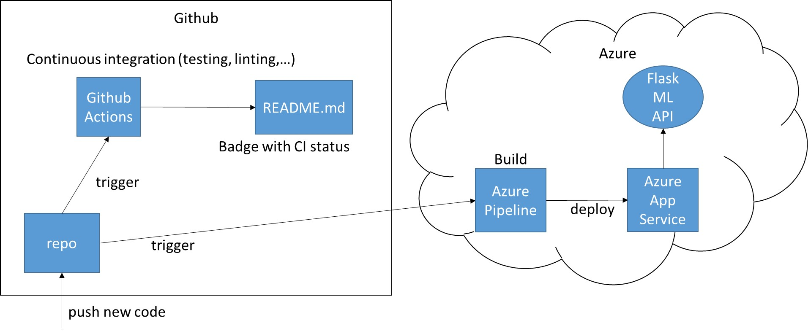

[](https://github.com/lx2gh/Udacity_Project2/actions)

# Overview

This is a Machine Learning Microservice which features a REST-API to predict house prices. It is trained with the Boston housing prices dataset, is implemented im Python and runs on an Azure App Service.
This project makes use of Continuous Integration (CI) via Github Actions and Continious Dellivery (CD) via azure pipelines

## Project Plan

The project spreadsheet can be found under [/plan/spreadsheet.xlsx](/plan/spreadsheet.xlsx) and here is a link to the [Trello Board](https://trello.com/b/yWGD7Lut/mlmicroservice)

## Instructions

Architectural Diagram of project: 


<TODO:  Instructions for running the Python project.  How could a user with no context run this project without asking you for any help.  Include screenshots with explicit steps to create that work. Be sure to at least include the following screenshots:

* Project running on Azure App Service

* Project cloned into Azure Cloud Shell

* Passing tests that are displayed after running the `make all` command from the `Makefile`

* Output of a test run

* Successful deploy of the project in Azure Pipelines.  [Note the official documentation should be referred to and double checked as you setup CI/CD](https://docs.microsoft.com/en-us/azure/devops/pipelines/ecosystems/python-webapp?view=azure-devops).

* Running Azure App Service from Azure Pipelines automatic deployment

* Successful prediction from deployed flask app in Azure Cloud Shell.  [Use this file as a template for the deployed prediction](https://github.com/udacity/nd082-Azure-Cloud-DevOps-Starter-Code/blob/master/C2-AgileDevelopmentwithAzure/project/starter_files/flask-sklearn/make_predict_azure_app.sh).
The output should look similar to this:

```bash
udacity@Azure:~$ ./make_predict_azure_app.sh
Port: 443
{"prediction":[20.35373177134412]}
```

* Output of streamed log files from deployed application

> 

## Enhancements

<TODO: A short description of how to improve the project in the future>

## Demo 

<TODO: Add link Screencast on YouTube>


