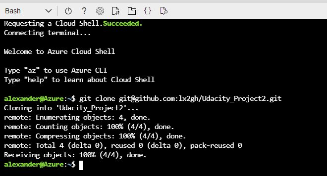
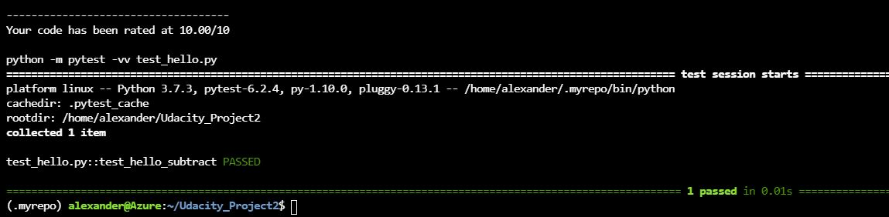
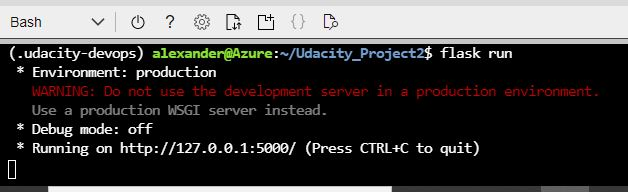
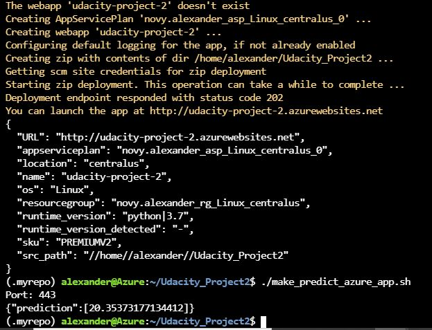
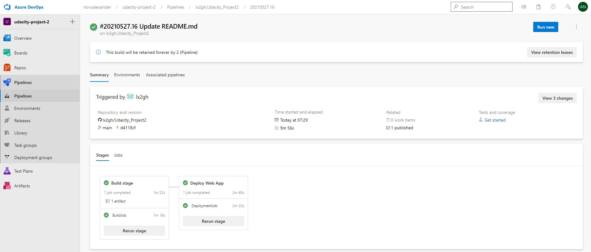
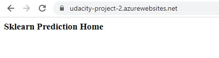
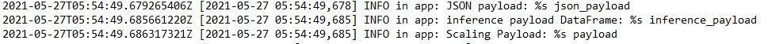

[](https://github.com/lx2gh/Udacity_Project2/actions)

# Overview

This is a Machine Learning Microservice which features a REST-API to predict house prices. It is trained with the Boston housing prices dataset, is implemented im Python and runs on an Azure App Service.
This project makes use of Continuous Integration (CI) via Github Actions and Continious Dellivery (CD) via azure pipelines

## Project Plan

The project spreadsheet can be found under [/plan/spreadsheet.xlsx](/plan/spreadsheet.xlsx) and here is a link to the [Trello Board](https://trello.com/b/yWGD7Lut/mlmicroservice)

## Instructions

Architectural Diagram of project: 


* Get an Azure account and log into [azure portal](https://portal.azure.com)

* Open cloud shell

* Generate ssh key by using following command:

```bash
user@Azure:~$ ssh-keygen -t rsa
```

* Copy ssh key and add it to your github account 

* Clone this repo into Azure Cloud Shell. Output should look like this:


* Set up Python virtual environment by executing: 
```bash
make setup
```
* Activate virtual environment:
```bash
source ~/.udacity-devops/bin/activate
```
* Install requirements and test project setup:
```bash
make all
```
Expected output:


* To conduct a test run hosted in the Azure Cloud Shell type the following commands:
```bash
export FLASK_APP=app.py
flask run
```
Expected output:<br>


* Deploy to Azure App Service (make sure to replace <app-name> with an actual app name of your choice):
```bash
az webapp up -n <app-name>
```

* Now you can call the REST-API from your brand new app service to make a prediction:
  * First modify file "./make_predict_azure_app.sh" by replacing the url of the app service with the one generated in the step before
  * Then call ./make_predict_azure_app.sh:
    ```bash
    ./make_predict_azure_app.sh
    ```
Expected output:<br>

 
* Now its time for setting up the Azure Pipeline:
 * Go to [https://aex.dev.azure.com/](https://aex.dev.azure.com/) and create a new project
 * Enter new project and go to Pipleines -> create new Pipeline
 * Choose github. It will automatically detect the pipleine.yml file of this project and set everything up for you!
[Note the official documentation should be referred to and double checked as you setup CI/CD](https://docs.microsoft.com/en-us/azure/devops/pipelines/ecosystems/python-webapp?view=azure-devops).

* When you choose to run the pipeline manually or everytime you check in new code, the pipeline will run automatically:<br>

 
* Now you can go to the url of your deployed app service and see the following:

 
* You can take a look at the logs by typing:
 ```bash
 az webapp log tail
 ```
 Expected output:<br>
 


> 

## Enhancements

<TODO: A short description of how to improve the project in the future>

## Demo 

<TODO: Add link Screencast on YouTube>


